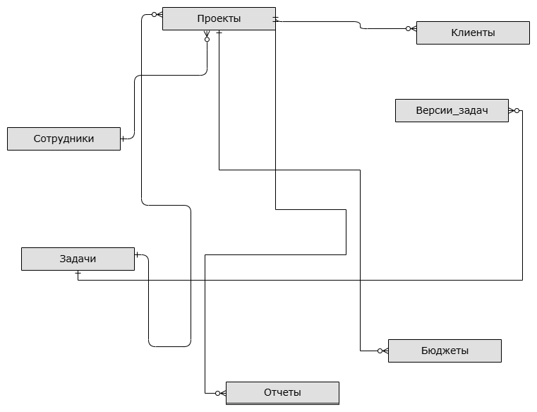
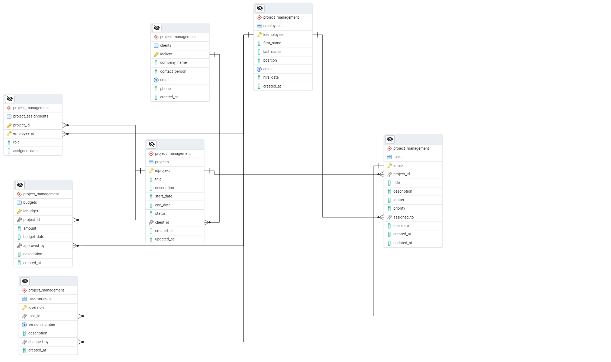
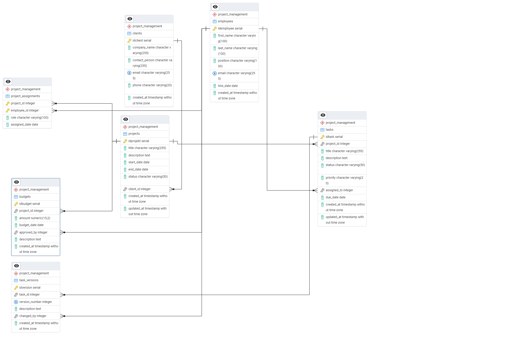

# Система управления IT-проектами (bd_project)

## 1. Модели базы данных

### Концептуальная модель
[](Диаграмма.png)

### Логическая модель
[](логическая_модель.png)

### Физическая модель
[](физическаая_модель.png)

## 2. SQL скрипты
Все скрипты находятся в папке [request](request)

### Основные скрипты:
| Скрипт | Назначение |
|--------|------------|
| [DDL](ddl.sql) | Создание структуры БД |
| [DML](dml.sql) | Наполнение тестовыми данными |
| [check](check.sql) | Проверка статистики БД |

## 3. Описание базы данных
**СУБД:** PostgreSQL 14+  
**Нормальная форма:** 3NF (Третья нормальная форма)  
**Схема:** `project_management`

### Обоснование нормальной формы:
1. **1NF**: Все атрибуты атомарны, нет повторяющихся групп
2. **2NF**: Нет частичных зависимостей от составного ключа
3. **3NF**: Нет транзитивных зависимостей

## 4. Структура таблиц

### Основные таблицы:
- `clients` - данные клиентов (15+ записей)
- `projects` - проекты компании (15+ записей)
- `employees` - сотрудники (15+ записей)
- `tasks` - задачи проектов (15+ записей)

### Таблицы-связки:
- `project_assignments` - назначения сотрудников (30+ записей)

### Версионные таблицы:
- `task_history` - история изменений задач (30+ записей)

## 5. Дополнительные объекты БД

### Представления:
- `active_projects` - активные проекты
- `employee_tasks` - задачи по сотрудникам

### Индексы:
- `idx_projects_status` - для ускорения фильтрации по статусу
- `idx_tasks_priority` - для быстрого поиска по приоритету

### Триггеры:
- `update_project_timestamp` - автообновление времени изменения
- `validate_task_dates` - проверка корректности дат

## 6. Анализ данных
Примеры анализа с использованием Python:
```python
# Распределение задач по статусам
df = pd.read_sql("SELECT status, COUNT(*) FROM tasks GROUP BY status", conn)
df.plot(kind='bar', title='Статусы задач')